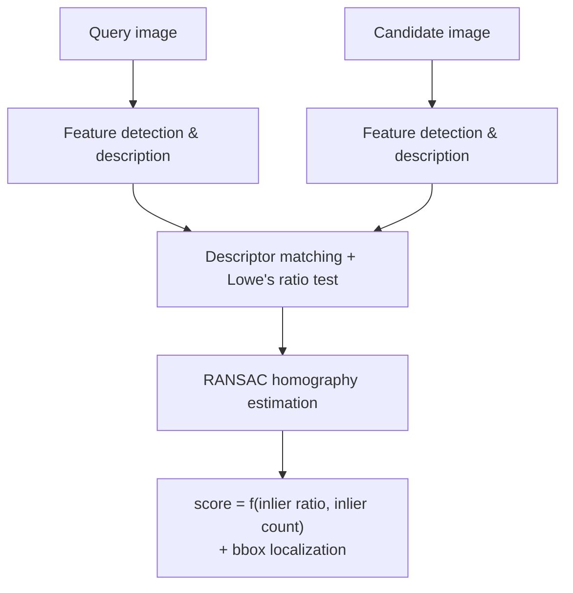

<p align="center">
  
</p>

## *retrieve the image source of any visual crop*

[](https://www.python.org/)
[](https://github.com/astral-sh/uv)
[](https://github.com/astral-sh/ruff)

[](https://iiif.io/)


CropCatcher is a Python package for determining whether two images show the same physical content, either entirely or when one image is a crop of the other.

It orchestrates classical [OpenCV](https://opencv.org/)-based local feature matching methods such as [SIFT](https://en.wikipedia.org/wiki/Scale-invariant_feature_transform), [AKAZE](https://docs.opencv.org/4.10.0/db/d70/tutorial_akaze_matching.html) and [ORB](https://en.wikipedia.org/wiki/Oriented_FAST_and_rotated_BRIEF), with descriptor matching, [RANSAC](https://en.wikipedia.org/wiki/Random_sample_consensus) and [homography](https://en.wikipedia.org/wiki/Homography_(computer_vision)) estimation for geometric verification and localization and exposes with a simple API.

CropCatcher is not a semantic similarity tool: It is designed to identify the exact source image, rank candidates and, when relevant, locate the query inside the matching image.

**Typical Cultural Heritage use case**: you've found an old, low-resolution or cropped image
somewhere — a screenshot, a thumbnail, a scan on a blog or in a PDF — and you
suspect it comes from a page held in a digital library such as Gallica.
CropCatcher searches across one or more IIIF manifests,
tells you which page
it's actually contained in and where, and hands back that page's IIIF
service — so you can fetch the original at full resolution and read off its
metadata (manuscript, shelfmark, folio) straight from the manifest.


A real query crop (left) matched with SIFT against real folios from the
*same* manuscript on Gallica: the true
source scores clearly highest (green) and is accepted, while other pages
sharing the same script, style and parchment (red) score far lower and are
rejected. See [Evaluation](#evaluation) for how this holds up across
methods and distortions.


**The other half of the job is equality**: you hold a whole folio image and
need to know *which canvas of a manifest it is*: the same content, but a
different digitization, resolution or crop of the margins. Same machinery,
no crop involved; see [batch reconciliation](#batch-reconciliation).


## Install

```bash
uv add cropcatcher
```

```bash
pip install cropcatcher
```

Requires Python >= 3.13. Dependencies: `opencv-contrib-python-headless`, `numpy`.

> [!WARNING]
> Not published yet. CropCatcher is not on PyPI, so neither command works as
> written. Until the first release ships, install from a clone:
>
> ```bash
> git clone <repository> && cd IIIF_image_matcher
> uv sync                      # add --group notebook for the notebooks
> ```

## Usage

```python
from cropcatcher import Matcher

matcher = Matcher(method="sift")  # or "akaze", "orb", "star_brief"

results = matcher.search(
    query="illumination.jpg",
    images="folios/",  # a directory, a list of paths, or a single path
)

best = results.best
print(best.source, best.score, best.inliers, best.bbox)
```

Each result is a `MatchResult`:

```python
MatchResult(
    source="folio_142r.jpg",
    score=0.87,
    matches=94,
    inliers=61,
    inlier_ratio=0.65,
    bbox=(412, 580, 1034, 1280),
    homography=...,
)
```

- **`source`** — identifier of the matched candidate: a file path for
  `search`/`Index.add_images`, or an IIIF Image API service id for
  `search_iiif`/`Index.add_iiif`.
- **`score`** — overall confidence in `[0, 1]`. Combines `inlier_ratio` and
  `inliers` (weighted 0.6/0.4), so it rewards both a *clean* match and a
  *large* one — driven mainly by geometrically consistent inliers, not the
  raw descriptor match count.
- **`matches`** — descriptor matches that passed Lowe's ratio test (from the
  original [SIFT](https://en.wikipedia.org/wiki/Scale-invariant_feature_transform)
  paper — see [Pipeline](#pipeline)), before any geometric check — an upper
  bound on `inliers`.
- **`inliers`** — of those, the ones geometrically consistent with the
  estimated [homography](https://en.wikipedia.org/wiki/Homography_(computer_vision))
  under [RANSAC](https://en.wikipedia.org/wiki/Random_sample_consensus) — the
  primary evidence of an actual match (see [Pipeline](#pipeline)).
- **`inlier_ratio`** — `inliers / matches`: how clean the match is,
  independent of how large it is.
- **`bbox`** — `(x0, y0, x1, y1)`, the query's bounding box localized inside
  the candidate by projecting its corners through `homography`. `None` if
  fewer than `min_inliers` RANSAC inliers were found.
- **`homography`** — the 3×3 projective transform (`numpy.ndarray`) mapping
  the query onto the candidate. `None` under the same condition as `bbox`.

### Searching IIIF manifests

```python
results = matcher.search_iiif(
    query="illumination.jpg",
    manifests=["https://example.org/manifest.json"],
)
```

Manifests are resolved (Presentation API v2 and v3), and candidate images are
fetched via the IIIF Image API at a reduced size (`!1024,1024` by default) to
avoid downloading full-resolution scans during the search.

Each candidate is **downloaded, described and matched as a single unit of
work**, spread over a `ThreadPoolExecutor` (`max_workers=8` by default). This
matters more than it sounds: OpenCV releases the GIL during
`detectAndCompute`/`knnMatch`/`findHomography`, so those threads give real
multi-core parallelism, network waits overlap with matching instead of
preceding it, and only `max_workers` decoded images are held in memory rather
than the whole manifest.

Matching, not downloading, is the bottleneck — on a 30-canvas search, ~1.3 s
goes to the network and ~26 s to matching. So `max_workers` is really a CPU
knob: raising it towards your core count gives a near-linear speedup
(measured **40.9 s → 6.9 s**, ×6, going from `max_workers=1` to `16` on 16
cores). Be aware it also raises the number of concurrent requests to the IIIF
server, which can get you rate-limited — Gallica returns HTTP 429 if pushed.

```python
results = matcher.search_iiif(
    query="illumination.jpg",
    manifests=["https://example.org/manifest.json"],
    max_workers=16,     # CPU-bound: scale with cores, mind the server
    max_canvases=50,    # cap huge manifests (hundreds of pages)
)
```

### Indexing a corpus

Avoid recomputing descriptors for every query against a large, stable corpus:

```python
from cropcatcher import Index

index = Index(method="sift")
index.add_images("folios/")
index.add_iiif(["https://example.org/manifest.json"])  # also downloaded concurrently

index.save("collection.cropcatcher")

index = Index.load("collection.cropcatcher")
results = index.search("illumination.jpg")
```

### STAR+BRIEF and SURF (optional/experimental)

`method="star_brief"` works out of the box (STAR/CenSurE detector + BRIEF
binary descriptor, not patented). `method="surf"` is also registered, but
SURF is patented and excluded from the prebuilt `opencv-contrib-python`
wheels PyPI ships — instantiating `Matcher(method="surf")` raises a clear
`RuntimeError` unless you supply a custom OpenCV build compiled with
`-DOPENCV_ENABLE_NONFREE=ON`.

### Visualizing a match

```python
from cropcatcher.visualization import draw_matches, draw_localization

debug = matcher.explain(query="illumination.jpg", candidate="folio_142r.jpg")
draw_matches(debug)  # inliers in green, outliers in red
draw_localization(debug.candidate_image, debug.query_image.shape, debug.result.homography)
```

## Playground notebook

An interactive, bilingual (FR/EN) notebook covering the whole pipeline —
keypoint detection, ratio filtering, RANSAC/homography, localization,
SIFT vs AKAZE vs ORB, indexing, and IIIF — using self-generated synthetic
images so it runs fully offline:

```bash
uv sync --group notebook
uv run python -m ipykernel install --user --name cropcatcher --display-name "Python (CropCatcher)"
uv run jupyter lab notebooks/playground.ipynb
```

[`notebooks/iiif_guide.ipynb`](notebooks/iiif_guide.ipynb) is a companion
notebook focused on `search_iiif` against **real** Gallica manifests, reusing
the same crops and manifests as [Evaluation](#evaluation)
(`tests/fixtures/mandragore/`). It covers two simple, realistic usage
patterns — searching a crop in a manifest you already know, and searching
several crops across a short list of candidate manifests — and needs
internet access (no local server):

```bash
uv sync --group notebook
uv run jupyter lab notebooks/iiif_guide.ipynb
```

### Batch reconciliation

[`notebooks/reconciliation.ipynb`](notebooks/reconciliation.ipynb) is the
batch counterpart: give it a CSV where **one row = one folio image + its
manuscript's IIIF manifest**, and it writes a new CSV listing, for each
folio, the **top-N candidate canvases** of that manifest — i.e. which
digitized page each image actually is.

The number of candidates is configurable, and the output is tidy (one row per
*folio × rank*), so narrowing from three candidates to one is a filter on the
result rather than a re-run. It groups rows by manifest and builds an `Index`
once per manuscript, since several folios usually share one manifest —
downloading and describing each canvas once instead of once per folio.

## Pipeline



- **Feature detection & description** — finds distinctive keypoints and
  encodes their local neighborhood into a descriptor vector, independently
  for the query and each candidate:
  [SIFT](https://en.wikipedia.org/wiki/Scale-invariant_feature_transform)
  (float descriptors), AKAZE (nonlinear-diffusion scale space, binary
  descriptors), [ORB](https://en.wikipedia.org/wiki/Oriented_FAST_and_rotated_BRIEF)
  (binary descriptors, built on the
  [FAST](https://en.wikipedia.org/wiki/Features_from_accelerated_segment_test)
  corner detector), or optionally STAR+BRIEF /
  [SURF](https://en.wikipedia.org/wiki/Speeded_up_robust_features)*.
- **Descriptor matching + Lowe's ratio test** — each query descriptor is
  matched to its nearest candidate descriptor (L2 distance for SIFT,
  [Hamming distance](https://en.wikipedia.org/wiki/Hamming_distance) for the
  binary methods); a match is only kept if the nearest neighbor is
  meaningfully closer than the second-nearest, per the ratio test from the
  original [SIFT](https://en.wikipedia.org/wiki/Scale-invariant_feature_transform)
  paper — this discards most ambiguous, background-clutter matches early.
  Passing `mutual_check=True` adds a symmetry requirement on top: the
  candidate descriptor's own nearest neighbour must be the query descriptor
  it was matched from. On the evaluation set below this raises SIFT's
  match-detection precision from 0.26 to 0.91 (28 false positives down to 1)
  and more than doubles the score margin separating true from false pairs,
  for ~22% more matching time and no loss in Recall@1.
- **RANSAC homography estimation** —
  [RANSAC](https://en.wikipedia.org/wiki/Random_sample_consensus) repeatedly
  fits a [homography](<https://en.wikipedia.org/wiki/Homography_(computer_vision)>)
  from random subsets of the surviving matches, keeping the one with the
  largest geometrically consistent inlier set. This is the step that turns
  "many descriptors happen to look similar" into "these two regions are
  actually the same physical content, related by a single perspective
  transform."
- **Score + bbox localization** — `score` combines the inlier ratio and
  inlier count (see [`MatchResult`](#usage) above); `bbox` projects the
  query's corners through the homography to localize it inside the
  candidate.

\* SURF requires a custom OpenCV build (see above).

## Evaluation

CropCatcher ships a small, real-world evaluation dataset and a benchmarking
module (`cropcatcher.evaluation`) that compares SIFT, AKAZE and ORB on actual
IIIF manifests — not synthetic images.

### Dataset

`tests/fixtures/mandragore/` is built from the BnF's [Mandragore — échantillon
segmenté 2019](https://api.bnf.fr/index.php/fr/mandragore-echantillon-segmente-2019)
dataset: 631 manually segmented illuminations (bounding box + legend) across 8
real Gallica manuscripts, released under the [Gallica reuse
terms](https://gallica.bnf.fr/html/und/conditions-dutilisation-des-contenus-de-gallica).
The full CSV (`Segments_Enluminures.csv`) is kept as-is for future, larger
evaluation runs.

`dataset.json` packages a hand-picked subset of **10 cases from 5
manuscripts**. Each case has a query crop cached locally — the one asset that
can't be regenerated from a manifest — and the IIIF Image API service id of
its true source canvas, resolved live from Gallica at evaluation time:

| manuscript | legend | canvas |
|---|---|---|
| Français 1291 — Gaston Phébus, *Livre de la chasse* | Gaston Phébus et veneurs | f. 2v |
| Français 1291 — Gaston Phébus, *Livre de la chasse* | Faune : cerf | f. 5v |
| Arabe 274 — *Barlaam et Josaphat* | Saints Barlaam et Josaphat | f. 1v |
| Arabe 274 — *Barlaam et Josaphat* | Saint Josaphat dans son palais | f. 11v |
| Grec 2736 — Oppien, *Cynégétiques* | Chasse diurne | f. 4v |
| Grec 2736 — Oppien, *Cynégétiques* | Chevaux combattant des bêtes sauvages | f. 9 |
| Français 225 — Pétrarque, *De remediis utriusque fortunae* | Allégorie : Roue de la Fortune | f. 1 |
| Français 225 — Pétrarque, *De remediis utriusque fortunae* | Allégorie : Raison et l'homme | f. 8 |
| Latin 757 — Bible historiale | Création : lumière | f. 24 |
| Latin 757 — Bible historiale | Armes de Julien Regin | f. 4 |

### Method

`cropcatcher.evaluation.evaluate_method` builds the full 10×10 query×candidate
similarity matrix — every crop matched against every candidate canvas, not
only its own true source — from which it derives:

- **Recall@1 / Recall@3** — does the true source canvas rank first / in the
  top 3 by score?
- **Precision / recall / F1** — treating `inliers >= min_inliers` (the same
  threshold `Matcher` uses to gate a `bbox`) as a binary match/no-match
  classifier over all 100 pairs.
- **Mean inliers / inlier ratio** on the 10 true pairs.
- **Processing time**, split into feature detection and descriptor
  matching + RANSAC.

`cropcatcher.evaluation.evaluate_transforms` complements this with a
**robustness study**: each query crop is put through a battery of
image-level transformations — the sort of degradation a real crop can
suffer (photographed at an angle, resized, re-compressed) — and re-matched
against *only its own* true source canvas, to see how much score/inliers
degrade rather than how a whole corpus ranks:

| transform | what it simulates |
|---|---|
| `rotate_15` / `rotate_45` | the crop was photographed or scanned at an angle |
| `scale_50` / `scale_25` | a lower-resolution reproduction of the same crop |
| `jpeg_q10` | heavy JPEG compression artifacts |
| `perspective_heavy` | a page photographed off-axis (non-affine distortion) |

Reproduce all of it with:

```bash
uv sync --group notebook   # pulls in matplotlib
uv run python scripts/run_evaluation.py
```

### Results

| method | Recall@1 | Recall@3 | Precision | Recall | F1 | mean inliers | inlier ratio | ms/candidate |
|---|---|---|---|---|---|---|---|---|
| SIFT  | 1.00 | 1.00 | 0.24 | 1.00 | 0.39 | 1424.7 | 0.94 | 154.0 |
| AKAZE | 1.00 | 1.00 | 1.00 | 1.00 | 1.00 | 817.0  | 0.96 | 83.5  |
| ORB   | 0.90 | 0.90 | 0.90 | 0.90 | 0.90 | 553.5  | 0.84 | 13.9  |


### Reading the results

- **SIFT and AKAZE both reach perfect Recall@1/@3** on this sample: the true
  source canvas always scores highest, by a wide margin (min score 0.88 on
  the 10 true pairs vs. max 0.61 on the 90 unrelated pairs).
- **SIFT's precision (~0.24, and noticeably noisy run-to-run) is an artifact
  of thresholding raw inliers, not of the score.** A few unrelated pairs
  between richly decorated pages (dense script, similar borders)
  coincidentally hover right around the `min_inliers=8` bar — RANSAC's
  internal random sampling can nudge a handful of them past it on any given
  run — so `inliers >= min_inliers` alone misclassifies them, while every
  true pair still scores far above every false one. Ranking by `score`,
  which is what `Matcher.search`/`search_iiif` actually do, is unaffected;
  only a hard match/no-match cutoff needs a higher `min_inliers` (or a score
  threshold) to be precise on a corpus like this.
- **AKAZE matches SIFT's accuracy at ~46% less time per candidate**, and
  unlike SIFT stays precise even with the low `min_inliers=8` default — a
  good choice for a large, heterogeneous corpus.
- **ORB is ~11x faster than SIFT** but recall drops to 0.90: on the
  "Faune : cerf" crop (a small, low-contrast excerpt), ORB's default 500
  features aren't enough to find 8 RANSAC-consistent inliers at all, so that
  true pair is missed outright rather than merely under-scored.

### Robustness to transformations


- **SIFT never drops below Recall = 1.0** across any transform tested here,
  including a 45° rotation, a 4x downscale and heavy JPEG compression — a
  direct payoff of its scale/rotation-invariant design.
- **AKAZE is just as robust on recall**, but its match *quality* is visibly
  more sensitive to aggressive downscaling: mean inliers on the true pair
  drop from 817 (original) to 44 at `scale_25`, even though it still clears
  `min_inliers=8`.
- **ORB is the most fragile**: it's already missing one true match at full
  resolution, and a 4x downscale (`scale_25`) knocks its recall down further
  to 0.80 and its mean score to 0.77 — the fewer keypoints ORB extracts by
  default leave little margin once the image is degraded.

### Examples: a distorted crop among good and bad candidates

Two real cases, each with an artificial distortion applied to the query crop,
matched with SIFT against all 10 candidate canvases (true source in green,
decoys in red):


A 45° rotation is enough to make the crop unrecognizable to the eye at a
glance, yet the true source (Gaston Phébus, f. 2v) still scores 0.72 —
comfortably ahead of the next-best decoy (0.70, from an entirely different,
much smaller-scale illumination) and far ahead of the rest (≤ 0.65).


This crop ("Création : lumière") is one of the harder cases in the dataset —
mostly flat gold and blue fields with limited texture — warped as if
photographed off-axis. The true source still wins clearly (0.83 vs. 0.34 for
the closest decoy), but the margin is narrower than for a busier illumination,
illustrating why low-texture crops are the ones worth watching when tuning
`min_inliers` or `ransac_reproj_threshold` for a specific corpus.

This is a 10-case sample, meant to validate the evaluation pipeline
end-to-end on real IIIF data and give a first, honest read of the three
methods' tradeoffs — not a statistically robust benchmark. Growing
`tests/fixtures/mandragore/dataset.json` from the full 631-segment CSV (or
adding manifests of your own) will sharpen these numbers.

## Development

```bash
uv run pytest       # tests
uv run ruff format . # format
uv run ruff check .  # lint
```

## License

[MIT](LICENSE.md)

## Citation

If you use CropCatcher in your research, please cite (see
[`CITATION.cff`](CITATION.cff)) :

```bibtex
@software{terriel_cropcatcher,
  author  = {Terriel, Lucas},
  title   = {{CropCatcher: locate a query image inside candidate images using classical local feature matching algorithms, with IIIF support.}},
  year    = {2026},
  version = {0.0.1},
  license = {MIT}
}
```
