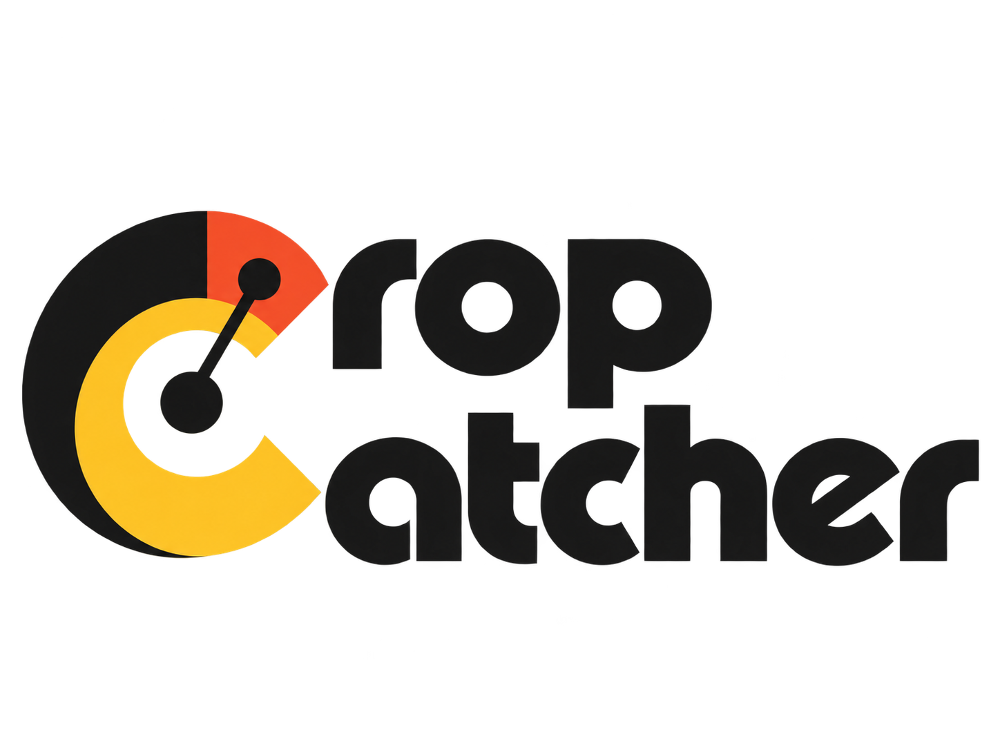
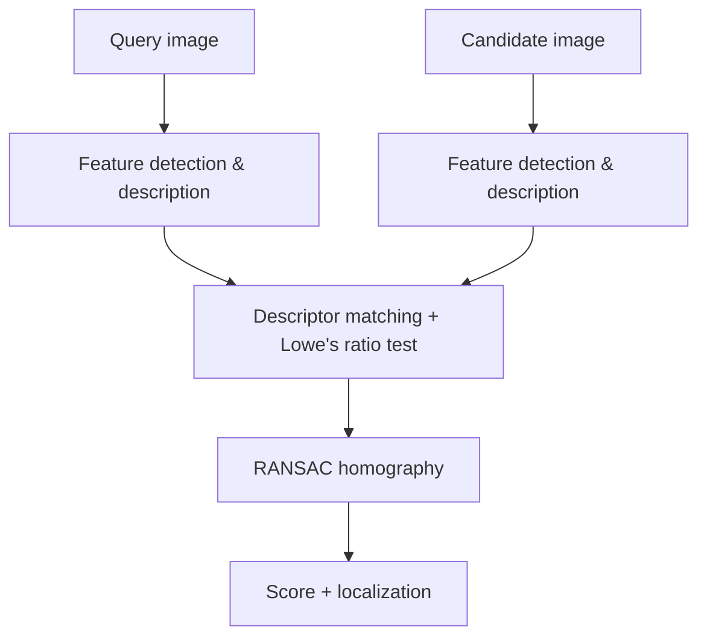
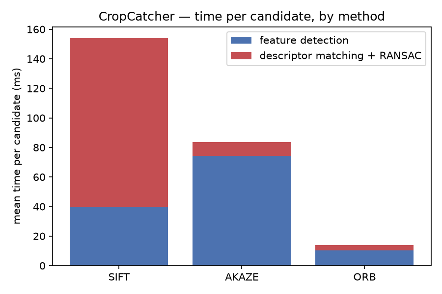
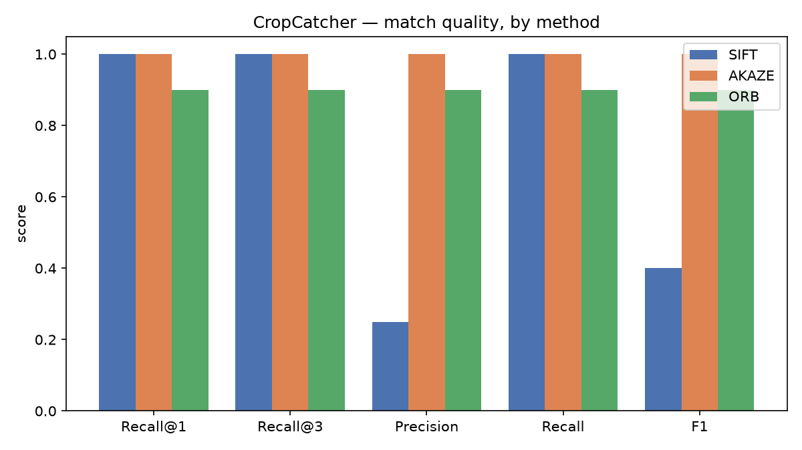
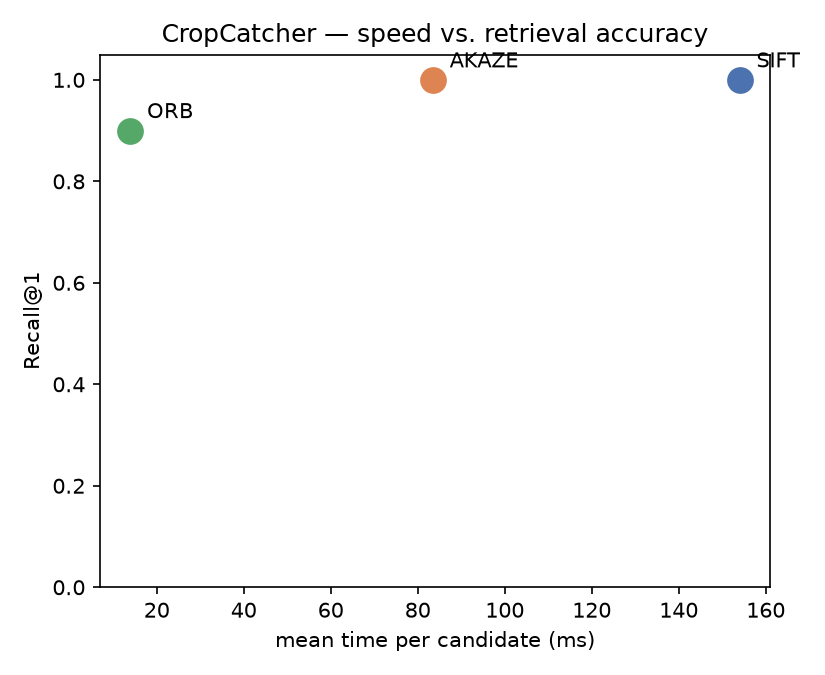
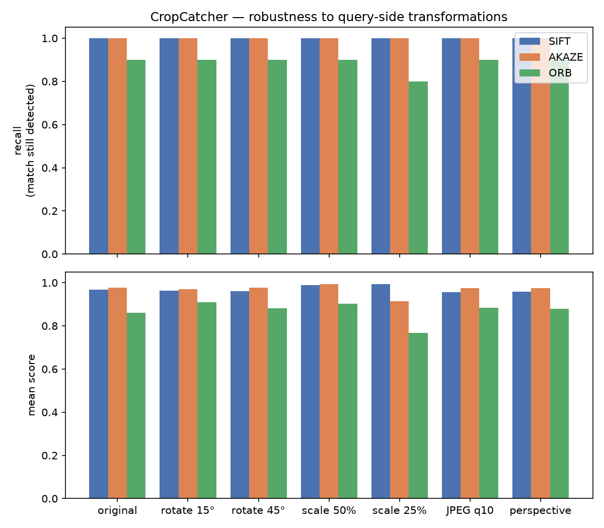
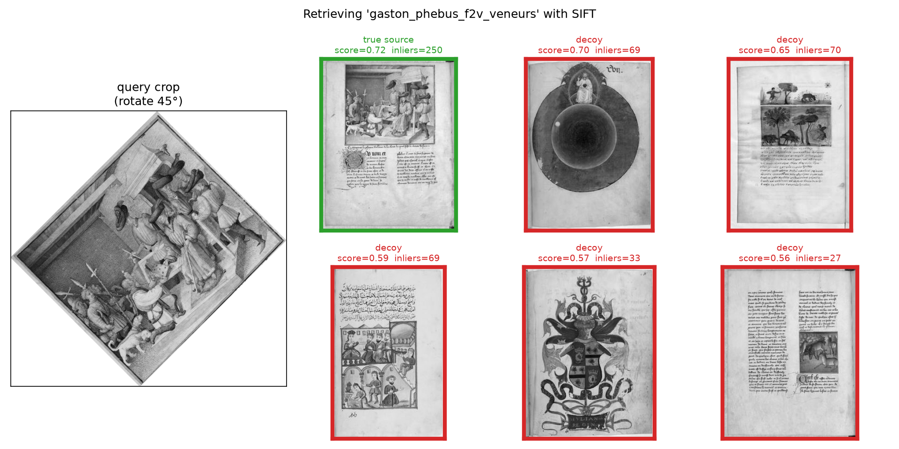
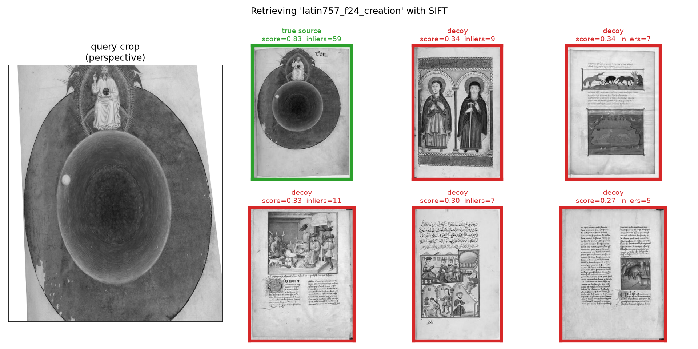

<p align="center">
  
</p>


## *retrieve the image source of any visual crop*

[](https://www.python.org/)
[](https://github.com/astral-sh/uv)
[](https://github.com/astral-sh/ruff)

[](https://iiif.io/)

CropCatcher is a Python package for determining whether two images show the same physical content.

It orchestrates classical [OpenCV](https://opencv.org/)-based local feature matching methods such as [SIFT](https://en.wikipedia.org/wiki/Scale-invariant_feature_transform), [AKAZE](https://docs.opencv.org/4.10.0/db/d70/tutorial_akaze_matching.html) and [ORB](https://en.wikipedia.org/wiki/Oriented_FAST_and_rotated_BRIEF), with descriptor matching, [RANSAC](https://en.wikipedia.org/wiki/Random_sample_consensus) and [homography](https://en.wikipedia.org/wiki/Homography_(computer_vision)) estimation for geometric verification and localization and exposes with a simple API.

CropCatcher is not a semantic similarity tool (not using visual embeddings): It is designed to identify the exact source image, rank candidates and, when relevant, locate the query inside the matching image.

**Typical Cultural Heritage use case**: you've found an old, low-resolution or cropped image
somewhere like a screenshot, a thumbnail, a scan on a blog or in a PDF and you
suspect it comes from a page held in a digital library such as [BnF-Gallica](https://gallica.bnf.fr/accueil/fr/html/accueil-fr).
CropCatcher searches across one or more [IIIF](https://iiif.io/) manifests,
tells you which page
it's actually contained in and where, and hands back that page's IIIF
service. So, you can fetch the original at full resolution and read off its
metadata (manuscript, shelfmark, folio) straight from the manifest.


A real query crop (left) matched with SIFT against real folios from the
*same* manuscript scrapped from BnF-Gallica: the true
source scores clearly highest (green) and is accepted, while other pages
sharing the same script, style and parchment (red) score far lower and are
rejected. See [Evaluation](#evaluation) for how this holds up across
methods and distortions.

## Install

> Requires `Python >= 3.13`

use `uv`: 

```bash
uv add cropcatcher
```

or `pip`:

```bash
pip install cropcatcher
```

## Install (for development only)

```bash
git clone git@github.com:odil-ai/cropcatcher.git && cd IIIF_image_matcher/
uv sync                                         # add --group notebook dev docs for the notebooks, lint tests, mkdocs etc.
```

## Usage

```python
from cropcatcher import Matcher

matcher = Matcher(method="sift")  # or any feature extraction method: "akaze", "orb", "star_brief"

results = matcher.search(
    query="my_query_image.jpg",
    images="local_images_folder/",  # a directory, a list of paths, or a single path
)

best = results.best
print(best.source, best.score, best.inliers, best.bbox)
```

Output: Each result is a `MatchResult`:

```python
MatchResult(
    source="image_14.jpg",
    score=0.87,
    matches=94,
    inliers=61,
    inlier_ratio=0.65,
    bbox=(412, 580, 1034, 1280),
    homography=...,
)
```

- **`source`**, identifier of the matched candidate: a file path for
  `search`/`Index.add_images`, or an IIIF Image API service id for
  `search_iiif`/`Index.add_iiif`.
- **`score`**, overall confidence in `[0, 1]`: Combines `inlier_ratio` and
  `inliers` (weighted 0.6/0.4), so it rewards both a *clean* match and a
  *large* one (driven mainly by geometrically consistent inliers, not the
  raw descriptor match count).
- **`matches`**: descriptor matches that passed Lowe's ratio test (from the
  original [SIFT](https://en.wikipedia.org/wiki/Scale-invariant_feature_transform)
  paper an upper
  bound on `inliers` check [Pipeline](#overall-pipeline), before any geometric check.
- **`inliers`** of those, the ones geometrically consistent with the
  estimated [homography](https://en.wikipedia.org/wiki/Homography_(computer_vision))
  under [RANSAC](https://en.wikipedia.org/wiki/Random_sample_consensus). The
  primary evidence of an actual match (see [Pipeline](#overall-pipeline)).
- **`inlier_ratio`**, `inliers / matches`: how clean the match is,
  independent of how large it is.
- **`bbox`**, `(x0, y0, x1, y1)` the query's bounding box localized inside
  the candidate by projecting its corners through `homography`. `None` if
  fewer than `min_inliers` RANSAC inliers were found.
- **`homography`**, the 3×3 projective transform (`numpy.ndarray`) mapping
  the query onto the candidate. `None` under the same condition as `bbox`.

### Searching IIIF manifests

```python
results = matcher.search_iiif(
    query="my_local_image.jpg",
    manifests=["https://example.org/manifest.json"],
)
```

Manifests are resolved (Presentation API v2 and v3), and candidate images are
fetched via the IIIF Image API at a reduced size (`!1024,1024` by default) to
avoid downloading full-resolution scans during the search.

> Each candidate is processed in parallel with a `ThreadPoolExecutor`. Since matching is the main bottleneck, increasing `max_workers` can significantly improve performance, with near-linear speedups up to the available CPU cores.
However, more workers also mean more concurrent IIIF requests, which may trigger server rate limits such as HTTP 429.

```python
results = matcher.search_iiif(
    query="my_local_image.jpg",
    manifests=["https://example.org/manifest.json"],
    max_workers=16,     # CPU-bound: scale with cores, mind the server
    max_canvases=50,    # cap huge manifests (hundreds of pages)
)
```

`max_canvases` limits how many canvases are searched per manifest, taking the first pages in manifest order. 

For example, max_canvases=50 with three manifests means up to 150 candidate pages. 

The manifest itself is still fully loaded; the limit only reduces image downloads and matching, which are the expensive steps. The default is `None`, meaning all canvases are searched.

Because this is simple truncation, it can cause false negatives if the target page lies beyond the limit. It should therefore be treated as a cost-control option for demos or quick searches, not as a retrieval strategy.
When possible, prefer selecting a relevant window of canvases around an expected folio rather than truncating from the beginning.

### Indexing a corpus

Avoid recomputing descriptors for every query against a large, stable corpus:

```python
from cropcatcher import Index

index = Index(method="sift")
index.add_images("my_local_files/")
index.add_iiif(["https://example.org/manifest.json"])  # also downloaded concurrently

index.save("collection.cropcatcher") # saved for later

index = Index.load("collection.cropcatcher") # load you index
results = index.search("illumination.jpg") # search in your index
```

### STAR+BRIEF and SURF (optional/experimental feature extraction methods)

`method="star_brief"` works out of the box (STAR/CenSurE detector + BRIEF
binary descriptor, not patented). `method="surf"` is also registered, but
SURF is patented and excluded from the prebuilt `opencv-contrib-python`
wheels PyPI ships. Instantiating `Matcher(method="surf")` raises a clear
`RuntimeError` unless you supply a custom OpenCV build compiled with
`-DOPENCV_ENABLE_NONFREE=ON`.

### Visualizing a match

```python
from cropcatcher.visualization import draw_matches, draw_localization

debug = matcher.explain(query="my_query_image.jpg", candidate="image-142.jpg")
draw_matches(debug)  # inliers in green, outliers in red
draw_localization(debug.candidate_image, debug.query_image.shape, debug.result.homography)
```

## Playground notebook

- [`notebooks/playground.ipynb`](notebooks/playground.ipynb) is an interactive, bilingual (FR/EN) notebook covering the whole pipeline (
keypoint detection, ratio filtering, RANSAC/homography, localization,
SIFT vs AKAZE vs ORB, indexing, and IIIF) using self-generated synthetic
images so it runs fully offline:

- [`notebooks/iiif_guide.ipynb`](notebooks/iiif_guide.ipynb) is a companion
notebook focused on `search_iiif` against **real** Gallica manifests, reusing
the same crops and manifests as [Evaluation](#evaluation)
(`tests/fixtures/mandragore/`). It covers two simple, realistic usage
patterns: searching a crop in a manifest you already know, and searching
several crops across a short list of candidate manifests.

<!--[`notebooks/reconciliation.ipynb`](notebooks/reconciliation.ipynb) is the
batch counterpart: give it a CSV where **one row = one folio image + its
manuscript's IIIF manifest**, and it writes a new CSV listing, for each
folio, the **top-N candidate canvases** of that manifest (i.e. which
digitized page each image actually is).

The number of candidates is configurable, and the output is tidy (one row per
*folio × rank*), so narrowing from three candidates to one is a filter on the
result rather than a re-run. It groups rows by manifest and builds an `Index`
once per manuscript, since several folios usually share one manifest.
Downloading and describing each canvas once instead of once per folio.
-->

To run notebooks us Jupyterlab: 

```bash
uv sync --group notebook
uv run jupyter lab notebooks/
```

## Overall pipeline



- **Feature detection & description**: extracts local keypoints and descriptors with [SIFT](https://en.wikipedia.org/wiki/Scale-invariant_feature_transform), [AKAZE](https://docs.opencv.org/4.x/db/d70/tutorial_akaze_matching.html), [ORB](https://en.wikipedia.org/wiki/Oriented_FAST_and_rotated_BRIEF), or optional STAR+BRIEF / [SURF](https://en.wikipedia.org/wiki/Speeded_up_robust_features).
- **Descriptor matching**: pairs similar descriptors using L2 or [Hamming distance](https://en.wikipedia.org/wiki/Hamming_distance), then filters ambiguous matches with Lowe's ratio test. `mutual_check=True` adds a bidirectional consistency check to reduce false positives.
- **RANSAC homography**: uses [RANSAC](https://en.wikipedia.org/wiki/Random_sample_consensus) to keep geometrically consistent matches and estimate a [homography](https://en.wikipedia.org/wiki/Homography_(computer_vision)) between the query and candidate.
- **Score + localization**: combines inlier ratio and count into a confidence score, then projects the query into the candidate to estimate its bounding box.

> SURF requires a custom OpenCV build (see above).

## Evaluation

CropCatcher ships a small, real-world evaluation dataset and a benchmarking
module (`cropcatcher.evaluation`) that compares SIFT, AKAZE and ORB on actual
IIIF manifests (not synthetic images).

### Dataset

`tests/fixtures/mandragore/` is built from the BnF's dataset [Mandragore — échantillon
segmenté 2019](https://api.bnf.fr/index.php/fr/mandragore-echantillon-segmente-2019)
: 631 manually segmented illuminations (bounding box + legend) across 8
real Gallica manuscripts, released under the [Gallica reuse
terms](https://gallica.bnf.fr/html/und/conditions-dutilisation-des-contenus-de-gallica).
The full CSV (`Segments_Enluminures.csv`) is kept as-is for future, larger
evaluation runs.

`dataset.json` packages a hand-picked subset of **10 cases from 5
manuscripts**. Each case has a query crop cached locally (the one asset that
can't be regenerated from a manifest) and the IIIF Image API service id of
its true source canvas, resolved live from Gallica at evaluation time:

| manuscript | legend | canvas |
|---|---|---|
| Français 1291 — Gaston Phébus, *Livre de la chasse* | Gaston Phébus et veneurs | f. 2v |
| Français 1291 — Gaston Phébus, *Livre de la chasse* | Faune : cerf | f. 5v |
| Arabe 274 — *Barlaam et Josaphat* | Saints Barlaam et Josaphat | f. 1v |
| Arabe 274 — *Barlaam et Josaphat* | Saint Josaphat dans son palais | f. 11v |
| Grec 2736 — Oppien, *Cynégétiques* | Chasse diurne | f. 4v |
| Grec 2736 — Oppien, *Cynégétiques* | Chevaux combattant des bêtes sauvages | f. 9 |
| Français 225 — Pétrarque, *De remediis utriusque fortunae* | Allégorie : Roue de la Fortune | f. 1 |
| Français 225 — Pétrarque, *De remediis utriusque fortunae* | Allégorie : Raison et l'homme | f. 8 |
| Latin 757 — Bible historiale | Création : lumière | f. 24 |
| Latin 757 — Bible historiale | Armes de Julien Regin | f. 4 |

### Method

`cropcatcher.evaluation.evaluate_method` builds the full 10×10 query×candidate
similarity matrix (every crop matched against every candidate canvas, not
only its own true source) from which it derives:

- **Recall@1 / Recall@3**: does the true source canvas rank first / in the
  top 3 by score?
- **Precision / recall / F1**: treating `inliers >= min_inliers` (the same
  threshold `Matcher` uses to gate a `bbox`) as a binary match/no-match
  classifier over all 100 pairs.
- **Mean inliers / inlier ratio** on the 10 true pairs.
- **Processing time**, split into feature detection and descriptor
  matching + RANSAC.


`cropcatcher.evaluation.evaluate_transforms` complements the retrieval benchmark with a robustness study. A simple crop-to-source comparison is too easy, so each query crop is degraded with realistic image transformations such as perspective changes, resizing and recompression, then matched only against its true source canvas.

The goal is not to rank a corpus, but to measure how score and inlier counts degrade under realistic distortions.

| transform | what it simulates |
|---|---|
| `rotate_15` / `rotate_45` | the crop was photographed or scanned at an angle |
| `scale_50` / `scale_25` | a lower-resolution reproduction of the same crop |
| `jpeg_q10` | heavy JPEG compression artifacts |
| `perspective_heavy` | a page photographed off-axis (non-affine distortion) |

Reproduce all of it with:

```bash
uv sync --group notebook   # pulls in matplotlib
uv run python scripts/run_evaluation.py
```

### Results

| method | Recall@1 | Recall@3 | Precision | Recall | F1 | mean inliers | inlier ratio | ms/candidate |
|---|---|---|---|---|---|---|---|---|
| SIFT  | 1.00 | 1.00 | 0.24 | 1.00 | 0.39 | 1424.7 | 0.94 | 154.0 |
| AKAZE | 1.00 | 1.00 | 1.00 | 1.00 | 1.00 | 817.0  | 0.96 | 83.5  |
| ORB   | 0.90 | 0.90 | 0.90 | 0.90 | 0.90 | 553.5  | 0.84 | 13.9  |







### Reading the results

- **SIFT and AKAZE achieve perfect Recall@1/@3** on this sample, with true matches clearly separated from false ones by score.
- **SIFT's low precision comes from the hard `min_inliers` threshold**, not from ranking quality. Some visually similar pages occasionally pass the threshold, while true matches still score much higher. A higher `min_inliers` or score threshold improves binary decisions.
- **AKAZE matches SIFT's retrieval accuracy while being about 46% faster per candidate** and remains more precise with the default threshold.
- **ORB is about 11x faster than SIFT**, but recall drops to 0.90 because small or low-contrast crops may not produce enough consistent features.

  
### Robustness to transformations



- **SIFT remains fully robust** across all tested transformations, including 45° rotation, 4x downscaling and heavy JPEG compression.
- **AKAZE also keeps Recall = 1.0**, but aggressive downscaling significantly reduces the number of inliers, even when matches still pass the threshold.
- **ORB is the most fragile**, with lower recall even at full resolution and further degradation under strong downscaling.

### Examples: a distorted crop among good and bad candidates

Two real examples illustrate how SIFT behaves under distortion:



- **45° rotation**: the true source still ranks first with a score of 0.72, ahead of all decoys.



- **Perspective distortion on a low-texture crop**: This crop ("Création : lumière") is one of the harder cases in the dataset (
mostly flat gold and blue fields with limited texture). The true source remains first (0.83 vs. 0.34 for the closest decoy), but the smaller margin shows that low-texture regions are more sensitive to parameter tuning.

This 10-case dataset is an **end-to-end validation sample**, not a statistically robust benchmark. Expanding `tests/fixtures/mandragore/dataset.json` with more IIIF examples will make the comparison more representative.


## Unit tests, format, lint

```bash
uv run pytest       # tests
uv run ruff format . # format
uv run ruff check .  # lint
```

## License

[MIT](LICENSE.md)

## Citation

If you use CropCatcher in your research, please cite (see
[`CITATION.cff`](CITATION.cff)) :

```bibtex
@software{terriel_cropcatcher,
  author  = {Terriel, Lucas},
  institution  = {{École nationale des chartes - PSL}},
  title   = {{CropCatcher: locate a query image inside candidate images using classical local feature matching algorithms, with IIIF support.}},
  year    = {2026},
  version = {0.0.1},
  license = {MIT},
}
```
