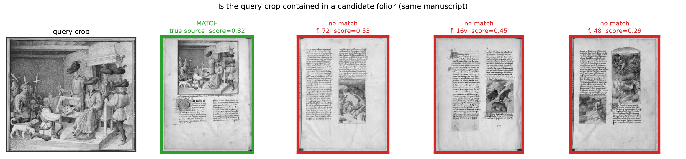
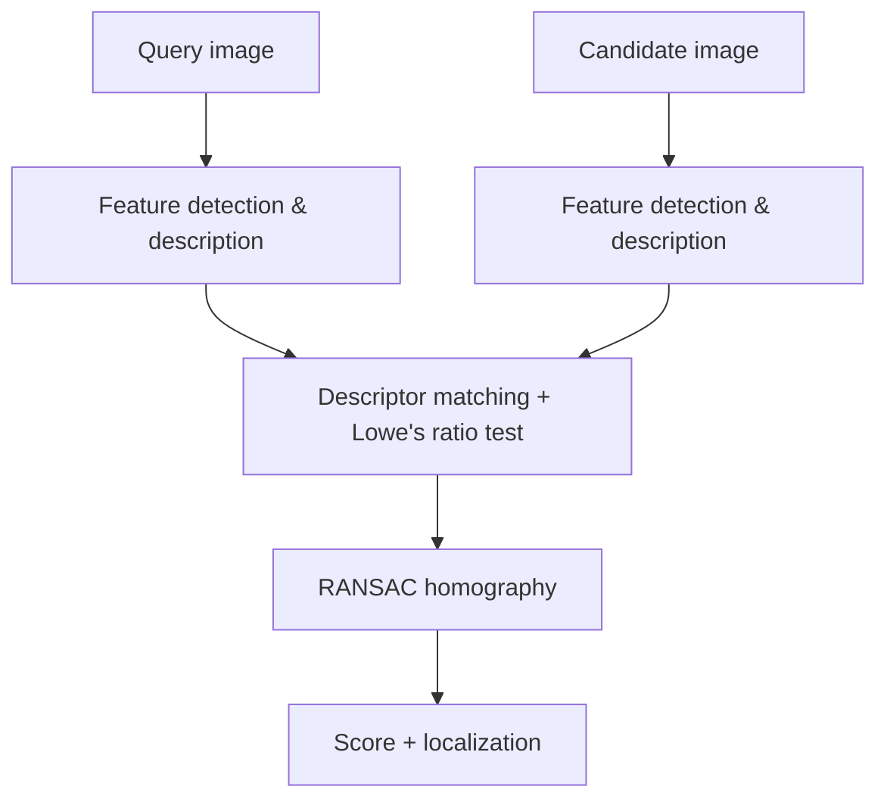

# CropCatcher

<p align="center">
  
</p>

<p align="center">
  <em>retrieve the image source of any visual crop</em>
</p>

<p align="center">
  <a href="https://www.python.org/"></a>
  <a href="https://github.com/astral-sh/uv"></a>
  <a href="https://github.com/astral-sh/ruff"></a>
  
  <a href="https://iiif.io/"></a>
  <a href="https://github.com/"></a>
</p>


CropCatcher is a Python package for determining whether two images show the same physical content.

It orchestrates classical [OpenCV](https://opencv.org/)-based local feature matching methods such as [SIFT](https://en.wikipedia.org/wiki/Scale-invariant_feature_transform), [AKAZE](https://docs.opencv.org/4.10.0/db/d70/tutorial_akaze_matching.html) and [ORB](https://en.wikipedia.org/wiki/Oriented_FAST_and_rotated_BRIEF), with descriptor matching, [RANSAC](https://en.wikipedia.org/wiki/Random_sample_consensus) and [homography](https://en.wikipedia.org/wiki/Homography_(computer_vision)) estimation for geometric verification and localization and exposes with a simple API.

CropCatcher is not a semantic similarity tool (not using visual embeddings): It is designed to identify the exact source image, rank candidates and, when relevant, locate the query inside the matching image.

**Typical Cultural Heritage use case**: you've found an old, low-resolution or cropped image
somewhere like a screenshot, a thumbnail, a scan on a blog or in a PDF and you
suspect it comes from a page held in a digital library such as [BnF-Gallica](https://gallica.bnf.fr/accueil/fr/html/accueil-fr).
CropCatcher searches across one or more [IIIF](https://iiif.io/) manifests,
tells you which page
it's actually contained in and where, and hands back that page's IIIF
service. So, you can fetch the original at full resolution and read off its
metadata (manuscript, shelfmark, folio) straight from the manifest.



A real query crop (left) matched with SIFT against real folios from the
*same* manuscript scrapped from BnF-Gallica: the true
source scores clearly highest (green) and is accepted, while other pages
sharing the same script, style and parchment (red) score far lower and are
rejected. See [Benchmarks](benchmarks.md) for how this holds up across
methods and distortions.


## Install

> Requires `Python >= 3.13`

use `uv`: 

```bash
uv add cropcatcher
```

or `pip`:

```bash
pip install cropcatcher
```

## Install (for development only)

```bash
git clone git@github.com:odil-ai/cropcatcher.git && cd IIIF_image_matcher/
uv sync                                         # add --group notebook dev docs for the notebooks, lint tests, mkdocs etc.
```

## Quickstart

```python
from cropcatcher import Matcher

matcher = Matcher(method="sift")  # or any feature extraction method: "akaze", "orb", "star_brief"

results = matcher.search(
    query="my_query_image.jpg",
    images="local_images_folder/",  # a directory, a list of paths, or a single path
)

best = results.best
print(best.source, best.score, best.inliers, best.bbox)
```

Output: Each result is a `MatchResult`:

```python
MatchResult(
    source="image_142.jpg",
    score=0.87,
    matches=94,
    inliers=61,
    inlier_ratio=0.65,
    bbox=(412, 580, 1034, 1280),
    homography=...,
)
```

Against a digital library instead of local files:

```python
results = matcher.search_iiif(
    query="my_query_image.jpg",
    manifests=["https://gallica.bnf.fr/iiif/ark:/12148/btv1b8427253m/manifest.json"],
)
```

## How it works



- **Feature detection & description**: extracts local keypoints and descriptors with [SIFT](https://en.wikipedia.org/wiki/Scale-invariant_feature_transform), [AKAZE](https://docs.opencv.org/4.x/db/d70/tutorial_akaze_matching.html), [ORB](https://en.wikipedia.org/wiki/Oriented_FAST_and_rotated_BRIEF), or optional STAR+BRIEF / [SURF](https://en.wikipedia.org/wiki/Speeded_up_robust_features).
- **Descriptor matching**: pairs similar descriptors using L2 or [Hamming distance](https://en.wikipedia.org/wiki/Hamming_distance), then filters ambiguous matches with Lowe's ratio test. `mutual_check=True` adds a bidirectional consistency check to reduce false positives.
- **RANSAC homography**: uses [RANSAC](https://en.wikipedia.org/wiki/Random_sample_consensus) to keep geometrically consistent matches and estimate a [homography](https://en.wikipedia.org/wiki/Homography_(computer_vision)) between the query and candidate.
- **Score + localization**: combines inlier ratio and count into a confidence score, then projects the query into the candidate to estimate its bounding box.

> SURF requires a custom OpenCV build (see above).

## Where to go next

| If you want to… | See |
|---|---|
| Match against local images, understand `MatchResult` | [Matching local images](usage.md) |
| Search IIIF manifests, tune cost | [Searching IIIF](iiif.md) |
| Reconcile a whole CSV of folios | [Batch reconciliation](reconciliation.md) |
| Know how well it actually works | [Benchmarks](benchmarks.md) |

## Citation

If you use CropCatcher in your research, please cite it. Metadata also lives
in `CITATION.cff` at the repository root, which GitHub exposes through its
"Cite this repository" button.

```bibtex
@software{terriel_cropcatcher,
  author       = {Terriel, Lucas},
  title        = {{CropCatcher: Locate a Visual Crop Inside Candidate Images or IIIF Manifests}},
  organization = {École nationale des chartes - PSL},
  year         = {2026},
  version      = {0.1.0},
  license      = {MIT}
}
```

[OpenCV]: https://opencv.org/
[SIFT]: https://en.wikipedia.org/wiki/Scale-invariant_feature_transform
[AKAZE]: https://docs.opencv.org/4.10.0/db/d70/tutorial_akaze_matching.html
[ORB]: https://en.wikipedia.org/wiki/Oriented_FAST_and_rotated_BRIEF
[RANSAC]: https://en.wikipedia.org/wiki/Random_sample_consensus
[homography]: https://en.wikipedia.org/wiki/Homography_(computer_vision)
[nns]: https://en.wikipedia.org/wiki/Nearest_neighbor_search
